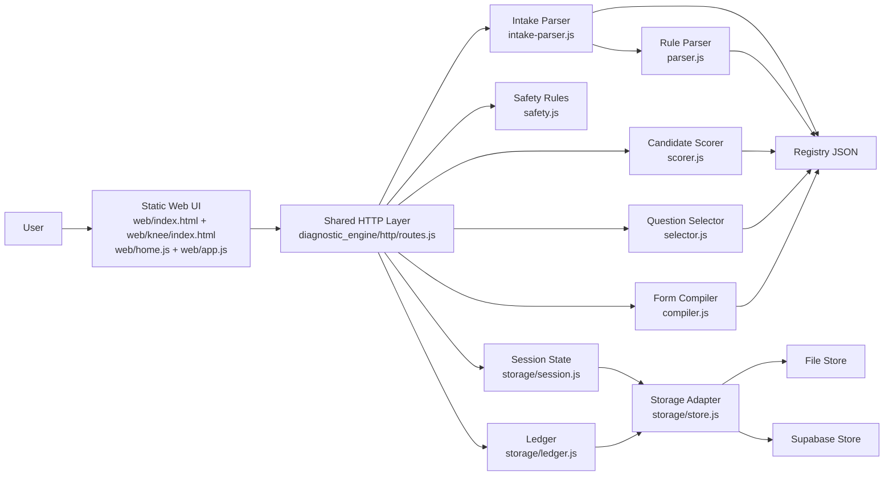
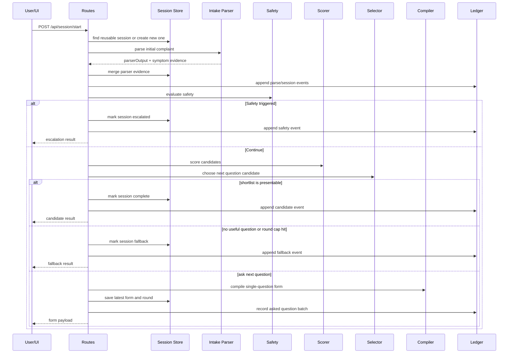

# System Architecture

This document describes the current architecture of the Diagnostic Engine repo as it exists today: a knee-only, registry-driven reasoning service with a static web UI, deterministic scoring, optional LLM-assisted intake parsing, and persistent session state.

## What This System Is

The system is a bounded symptom-reasoning engine for knee complaints.

It is not a diagnosis system. Its job is to:

- accept an opening complaint in free text
- convert that complaint into controlled symptom evidence
- store the evolving interview as a reusable session
- ask one high-value follow-up question at a time
- stop with one of three bounded outcomes:
  - shortlist of top candidates
  - fallback when evidence is still not decisive
  - escalation when safety rules trigger

Current modeled conditions:

- ACL tear
- Meniscal tear
- Patellofemoral pain syndrome
- Knee osteoarthritis

## Core Principles

- Registry-first: medical reasoning lives in JSON registries, not in UI text.
- Deterministic scoring: given the same symptom state, the scorer and selector return the same result.
- Controlled evidence: all downstream logic runs on symptom keys, not raw complaint text.
- Safety first: red-flag triage can interrupt the normal candidate flow.
- Auditable state: sessions and ledger entries are persisted.
- Deploy-once architecture: the same engine works locally and on Vercel.

## Repo Shape

```text
diagnostic_engine/
  core/
    engine/
      compiler.js
      fallback.js
      intake-parser.js
      parser.js
      safety.js
      scorer.js
      selector.js
    registry/
      diseases/knee/*.json
      questions/knee.json
      symptoms/knee.json
      loader.js
      validate.js
  http/
    routes.js
  runtime/
    config.js
    index.js
    runtime.js
    vercel-dispatch.js
  storage/
    file-store.js
    ledger.js
    session.js
    store.js
    supabase-store.js
  supabase/
    migrations/0001_diagnostic_mvp.sql
  benchmarks/
    harness.js
    profiles/
    results/
  tests/

api/
  health.mjs
  web.mjs
  session/*.mjs

web/
  index.html
  home.js
  knee/index.html
  app.js
  styles.css
```

## Top-Level Architecture



## Main Building Blocks

### 1. Registry

The registry is the source of truth for the domain model:

- `diagnostic_engine/core/registry/symptoms/knee.json`
- `diagnostic_engine/core/registry/questions/knee.json`
- `diagnostic_engine/core/registry/diseases/knee/*.json`

Responsibilities are intentionally separated:

- symptom registry: canonical symptom ids, categories, value types, scale labels
- question bank: question wording, phase, priority, gating conditions, and answer-to-symptom mappings
- disease files: stage-specific support, anti-symptoms, contradiction logic, and hard blocks

This keeps medical logic out of the browser and out of prompt text.

### 2. Registry Validation

`diagnostic_engine/core/registry/validate.js` validates the registry before the runtime serves requests.

It catches issues such as:

- broken symptom references
- invalid question mappings
- malformed disease definitions
- missing bounded-scope coverage

### 3. Runtime and Routing

The shared runtime is split across:

- `diagnostic_engine/runtime/index.js` for local Node hosting
- `diagnostic_engine/runtime/runtime.js` for lazy service initialization
- `diagnostic_engine/runtime/config.js` for environment/config resolution
- `diagnostic_engine/http/routes.js` for the actual HTTP behavior
- `api/*.mjs` as thin Vercel entry shims

The route layer handles:

- static file serving from `web/`
- `/api/session/start`
- `/api/session/answer`
- `/api/session/get`
- `/api/session/ledger`
- compatibility session routes
- `/api/health`

### 4. Browser UI

The browser layer is static and intentionally thin:

- `web/index.html` and `web/home.js` handle the overview-to-workspace handoff
- `web/knee/index.html` and `web/app.js` run the knee interview experience
- `web/styles.css` holds the shared visual system

The current knee workspace is one flattened workbench container with:

- a header row
- session metrics
- a status banner
- the active stage card

The active stage is always one of:

- intake
- form
- outcome

Shortlist results are shown in a structured modal popup, and the ledger is opened on its own page from the workspace.

## Runtime Data Model

### Symptom State

Sessions store evidence in `session.symptomState`, keyed by symptom id.

Each symptom entry contains:

- `value`
- `status`
- `source`
- `updatedAt`

Evidence status priority is enforced in `diagnostic_engine/storage/session.js`:

- `explicit`
- `inferred`
- `low_confidence`

Stronger evidence wins when symptom state is merged.

### Session Object

A session stores the live interview state:

- `sessionId`
- `patientId`
- `bodyRegion`
- `symptomState`
- `candidates`
- `eliminatedNodes`
- `questionLog`
- `latestForm`
- `rawMessages`
- `parserOutput`
- `round`
- `status`
- `debounceExpiresAt`
- timestamps

Current statuses:

- `pending`
- `questioning`
- `complete`
- `fallback`
- `escalated`

### Ledger

The ledger is append-only and records material steps, including:

- session creation or reuse
- parse merge
- round completion
- answers recorded
- candidate flagged
- fallback triggered
- safety escalated

## Request Flow

There are two primary write operations:

- `POST /api/session/start`
- `POST /api/session/answer`

Primary read operations:

- `GET /api/session/get?sessionId=...`
- `GET /api/session/ledger?sessionId=...`

Compatibility paths also exist for direct session and ledger reads.

### Start Session Flow



### Answer Flow

On `POST /api/session/answer`, the system:

1. loads the session
2. maps the submitted answer back to symptom ids
3. merges the new evidence as `explicit`
4. appends `ANSWERS_RECORDED`
5. re-runs the same evaluation loop

There is only one engine state. Free-text evidence and form evidence both feed the same symptom map.

## Intake Parsing

The intake layer is hybrid.

### Entry Point

`diagnostic_engine/core/engine/intake-parser.js` is the current entry point for initial complaint parsing.

It does three jobs:

- optional LLM-backed structured parsing
- deterministic fallback parsing
- building a UI-facing parser summary and evidence preview

### LLM Path

If `OPENAI_API_KEY` is configured, `intake-parser.js` calls the OpenAI Responses API and requests a structured JSON parse grounded in the symptom registry.

The LLM is constrained to return:

- boolean evidence
- 0-5 scale evidence
- a short summary
- unparsed leftovers

The output is normalized back into the same bounded symptom-entry structure used everywhere else.

### Deterministic Path

If no API key is configured, or the OpenAI request fails, the runtime falls back to `diagnostic_engine/core/engine/parser.js`.

That parser uses:

- regex-like phrase matching
- explicit negation handling
- simple severity inference
- simple timeline inference
- clause splitting for unmatched leftovers

The key invariant is the same in both modes:

> intake parsing may only emit controlled registry evidence

## Safety Layer

`diagnostic_engine/core/engine/safety.js` runs before candidate finalization.

It currently escalates on patterns such as:

- deformity
- fever with warmth or redness
- major trauma with marked weight-bearing difficulty

Safety logic is global by design. It is not attached to a single disease node.

## Candidate Scoring

`diagnostic_engine/core/engine/scorer.js` evaluates each disease across:

- acute
- subacute
- chronic

For each disease/stage pair it applies:

- weighted support
- anti-symptom penalties
- contradiction penalties
- explicit hard blocks
- normalization against known evidence

Current candidate bands:

- `confident`: score >= 80
- `possible`: score >= 60
- `low`: below 60
- `eliminated`: hard blocked

The public candidate stage is the best-scoring stage for that disease.

## Question Selection

`diagnostic_engine/core/engine/selector.js` chooses the next best unresolved question.

Selection considers:

- question priority
- question phase
- unknown mapped symptoms
- low-confidence or inferred evidence needing confirmation
- discrimination value for the current top candidates
- `requires`, `ask_if`, and `blocks_if`
- shortlist-specific relevance

The current route layer asks exactly one question at a time by calling the selector with `limit: 1`.

## Candidate Presentation Rules

Shortlist presentation is controlled in `diagnostic_engine/http/routes.js`, not just in the selector.

Current behavior:

- candidates are never shown before the configured minimum answered rounds
- default minimum answered rounds before candidates: `3`
- default round ceiling: `5`
- after the minimum floor, the engine only presents candidates if:
  - a confident shortlist exists, and
  - either the lead is decisive enough or there are no useful questions left

The current decisiveness rule is:

- top-candidate lead gap must be at least `15`
- otherwise, if the shortlist is still tight and another useful question exists, questioning continues

This is why the engine no longer always stops immediately after the third answered question.

## Form Compilation

`diagnostic_engine/core/engine/compiler.js` converts selected registry questions into a client-friendly form contract.

It is responsible for:

- compiling the single active question payload
- preserving authored registry question text
- attaching clarification notes
- providing the full `0-5` scale labels
- mapping submitted question responses back into symptom updates

The browser does not decide what a question means. It only renders the server-generated contract.

## UI Runtime Behavior

`web/app.js` manages the current browser flow:

- start in intake mode
- submit free text
- transition to the form stage
- render one question at a time
- keep session metadata visible
- open the shortlist modal when candidates are ready
- render fallback or escalation inline in the outcome stage

The browser remains a client for the route layer. It does not perform medical reasoning itself.

## Storage Architecture

`diagnostic_engine/storage/store.js` selects the active backend:

- `file` -> `diagnostic_engine/storage/file-store.js`
- `supabase` -> `diagnostic_engine/storage/supabase-store.js`

The route and engine layers stay storage-agnostic.

### File Store

Used for:

- local development
- tests
- benchmark runs

It writes session JSON and append-only ledger data under the configured local data directory.

### Supabase Store

Used for hosted deployments.

It stores:

- full session JSON in `diagnostic_sessions.session_data`
- append-only ledger rows in `diagnostic_ledger_entries`

This keeps the runtime stateless across Vercel invocations while preserving full session shape.

## Deployment Shape


The same reasoning core also runs locally through `diagnostic_engine/runtime/index.js`.

## Why This Architecture Works

This shape works for the current MVP because it keeps the important boundaries clean:

- browser concerns stay in `web/`
- request orchestration stays in `http/routes.js`
- reasoning stays in engine modules and registry JSON
- state persistence stays behind the store boundary

It also avoids common failure modes:

- no client-side diagnosis logic
- no prompt-only reasoning core
- no hidden in-memory server state dependency
- no need to couple storage details to the scoring engine

## Known Boundaries

The current system does not provide:

- multi-body-part reasoning
- calibrated prevalence-based probabilities
- clinician workflow integration
- user auth or tenant isolation
- broad open-domain medical understanding

The LLM intake parser is intentionally narrow and registry-bounded. It is not an open-ended diagnosis agent.

## Safe Extension Points

The safest ways to extend the system are:

- add more registry symptoms, questions, and disease nodes
- add a second body-part scope through a parallel registry set
- add richer analytics over the ledger
- change the persistence backend behind `storage/store.js`
- improve intake parsing without changing the symptom-state contract
- add auth and API controls around the existing route layer

The invariant to protect is:

> the engine should continue to reason over controlled symptom evidence rather than raw complaint text or UI-specific state
