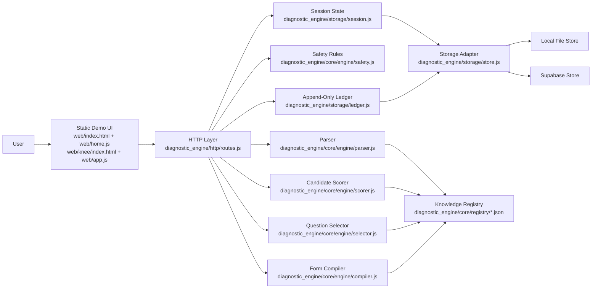
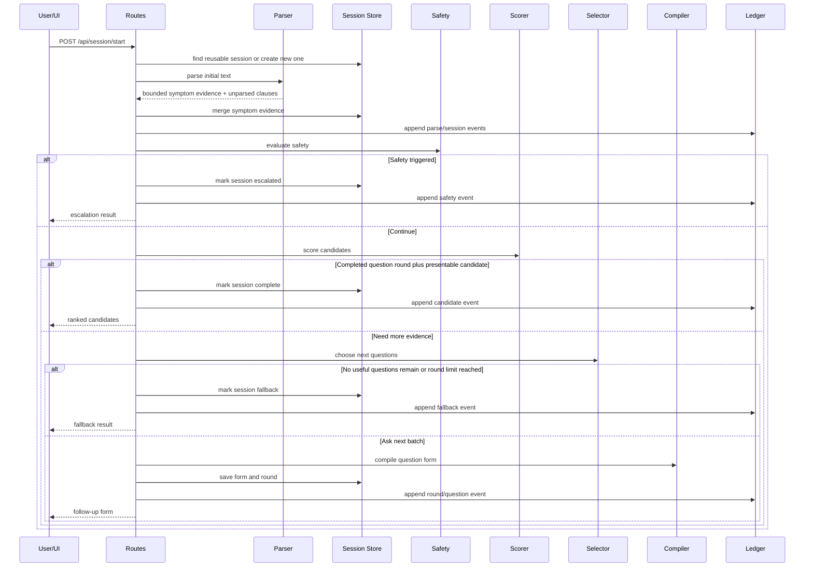
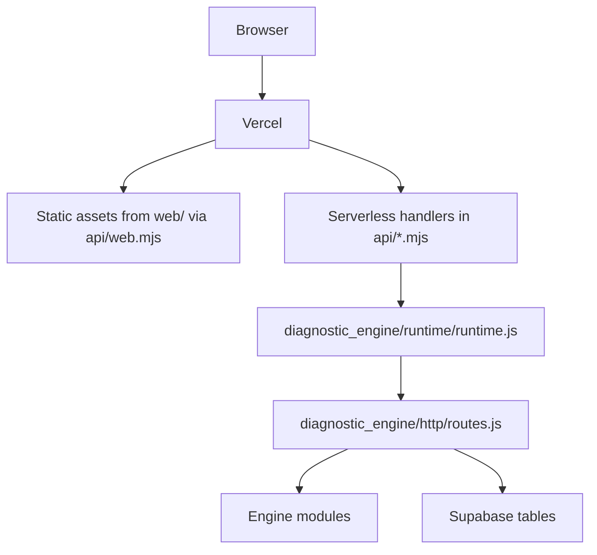

# System Architecture

This document explains what the diagnostic engine is, what parts it is made of, and how a request moves through the system from raw complaint text to a bounded result.

## What This System Is

The diagnostic engine is a deterministic, registry-driven symptom reasoning service for knee complaints.

It is designed as a mini MVP demo, not as a medical diagnosis system. Its job is to:

- take an initial free-text complaint
- convert that complaint into controlled symptom evidence
- score a small set of structured disease nodes
- ask the next best follow-up questions
- require at least one completed follow-up round before showing a shortlist
- escalate when red-flag patterns appear
- stop with a cautious fallback when the evidence is not strong enough

The current disease scope is intentionally narrow:

- ACL tear
- Meniscal tear
- Patellofemoral pain syndrome
- Knee osteoarthritis

## Core Design Philosophy

The system is built around a few hard rules:

- Registry-first, not prompt-first: all medical reasoning is grounded in explicit JSON registries.
- Deterministic behavior: the same evidence should produce the same scores and next questions.
- Bounded evidence: unknown facts stay unknown instead of being silently assumed false.
- Safety before ranking: red flags can interrupt normal candidate scoring.
- Auditable state: every session has persistent state plus an append-only ledger.
- Deployable MVP shape: the same engine works locally and on Vercel.

## Top-Level Architecture

## Main Building Blocks

### 1. Knowledge Registry

The registry is the source of truth for the engine's reasoning model.

It lives under:

- `diagnostic_engine/core/registry/symptoms/knee.json`
- `diagnostic_engine/core/registry/questions/knee.json`
- `diagnostic_engine/core/registry/diseases/knee/*.json`

The registry separates responsibilities cleanly:

- symptom registry: defines the controlled vocabulary and scale semantics
- question bank: defines interview questions and how answer options map back to symptoms
- disease nodes: define support patterns, anti-patterns, stages, and contradiction rules

This separation matters because it keeps the engine from hiding medical logic inside UI code or prompt text.

### 2. Registry Validation

Before the app starts, the registry is validated by `diagnostic_engine/core/registry/validate.js`.

Validation exists to catch structural problems early, such as:

- missing symptom references
- invalid question mappings
- malformed disease definitions
- broken coverage across the bounded knee scope

That means the runtime assumes the registry is internally consistent and can stay simpler during request handling.

### 3. HTTP and Runtime Layer

The shared runtime entry lives in:

- `diagnostic_engine/runtime/index.js` for local Node hosting
- `api/*.mjs` for Vercel serverless hosting
- `diagnostic_engine/runtime/runtime.js` for lazy service initialization
- `diagnostic_engine/http/routes.js` for the actual HTTP behavior

This split lets the same business logic run in two modes:

- local mode: `node diagnostic_engine/runtime/index.js`
- hosted mode: Vercel invokes the `api/*.mjs` shims

In both cases, the handler uses the same service graph:

- config
- validated registry
- storage adapter
- engine modules

### 4. Demo UI

The mini MVP frontend is intentionally simple and static:

- `web/index.html`
- `web/knee/index.html`
- `web/home.js`
- `web/app.js`
- `web/styles.css`

It does not contain clinical reasoning logic. It only:

- captures the homepage handoff and launches the knee workspace
- renders follow-up questions
- submits answers
- shows candidates in a structured popup, or renders fallback or escalation states
- loads the ledger for inspection

All reasoning stays server-side.

## Runtime Data Model

### Symptom Evidence

The engine stores evidence in `session.symptomState` keyed by symptom id.

Each entry has:

- `value`
- `status`
- `source`
- `updatedAt`

The `status` is important:

- `explicit`: directly answered by the user
- `inferred`: derived with confidence from deterministic parsing
- `low_confidence`: inferred from softer or tentative language

When evidence is merged, stronger evidence wins:

- `explicit` beats `inferred`
- `inferred` beats `low_confidence`

That prevents a tentative parse from overriding a later direct answer.

### Session

A session stores the working state of one interview:

- patient id
- body region
- symptom state
- current candidates
- eliminated nodes
- asked question batches
- latest form
- raw messages
- parser leftovers
- round count
- session status

Statuses move through a bounded lifecycle:

- `pending`
- `questioning`
- `complete`
- `fallback`
- `escalated`

### Ledger

The ledger is append-only and records major events, for example:

- session created
- session reused
- parse merged
- round complete
- answers recorded
- candidate flagged
- fallback triggered
- safety escalated

This gives the MVP an audit trail without making the runtime logic depend on logs.

## How The Engine Does What It Does

### Boot Sequence

At startup the runtime does four things:

1. load environment variables
2. build config
3. validate and load the registry
4. create services, including the selected store

Only after that does it begin serving requests.

### Request Flow

There are two core write operations:

- `POST /api/session/start`
- `POST /api/session/answer`

For hosted deployments, the main read operations are:

- `GET /api/session/get?sessionId=...`
- `GET /api/session/ledger?sessionId=...`

The shared handler also accepts `/session/:id` and `/session/:id/ledger` compatibility paths, and the local Node server accepts those directly.

### Start Session Flow

### Answer Flow

On `POST /api/session/answer`, the system:

1. loads the session
2. maps submitted question responses back into symptom keys
3. merges those as `explicit` evidence
4. appends an `ANSWERS_RECORDED` ledger entry
5. re-runs the same evaluation loop

This is important: there is not a separate scoring path for initial text and question answers. The entire engine runs on one accumulated symptom state.

The first pass after free-text intake can produce a strong internal shortlist, but the system still requires at least one completed follow-up round before it presents candidates to the user.

## Engine Modules In Detail

### Parser

`diagnostic_engine/core/engine/parser.js` converts raw text into bounded evidence.

It does this with:

- phrase-to-symptom regex rules
- negative rules for explicit denials
- simple severity inference
- simple timeline inference
- clause splitting to preserve unmatched leftovers

The parser never invents new symptom keys. If a clause does not map to the registry, it is preserved in `unparsed`.

This keeps the parser useful without letting it silently expand the domain.

### Safety Layer

`diagnostic_engine/core/engine/safety.js` runs before candidate ranking is allowed to finalize.

It currently escalates for:

- deformity
- fever with warmth or redness
- major trauma with marked weight-bearing difficulty

This logic is global on purpose. It does not belong to a single disease node because it is safety triage, not disease fit logic.

### Scorer

`diagnostic_engine/core/engine/scorer.js` evaluates every disease across three stages:

- acute
- subacute
- chronic

For each disease/stage pair it calculates:

- support from matching evidence
- penalties from anti-symptoms
- optional contradiction penalties
- hard blocking for confirmed disqualifiers
- normalization based on known evidence coverage

Important scoring behaviors:

- support is weighted by evidence confidence
- unknown evidence contributes nothing instead of counting as mismatch
- only explicit confirmed evidence can trigger certain hard blocks
- the best stage becomes that disease's current public candidate state

Candidate bands are then assigned:

- `confident`: score >= 80
- `possible`: score >= 60
- `low`: below 60
- `eliminated`: hard blocked

### Question Selector

`diagnostic_engine/core/engine/selector.js` chooses the next best questions instead of asking everything.

It scores each remaining question based on:

- question priority
- interview phase
- whether mapped symptoms are still unknown
- whether current evidence is only low confidence
- how much the mapped symptoms separate the current top candidates
- question `requires`, `ask_if`, and `blocks_if` conditions
- whether the question helps discriminate among the live shortlist

The system currently asks up to 4 questions in the first follow-up round and up to 3 in later rounds.

That first round also acts as a presentation gate: the shortlist is not shown until at least one question round has been answered.

### Form Compiler

`diagnostic_engine/core/engine/compiler.js` turns selected questions into a client-friendly form payload.

It also:

- adds clarification notes when a question targets low-confidence evidence
- normalizes 0 to 5 scale rendering
- maps answer payloads back into explicit symptom entries

That means the UI can stay dumb and the server remains the source of truth for both question semantics and answer interpretation.

### Fallback

`diagnostic_engine/core/engine/fallback.js` handles the bounded exit path when the system cannot support a confident result.

Fallback happens when:

- the round limit is reached
- there are no useful questions left

This is a deliberate product behavior. The engine is designed to stop cautiously rather than over-claim certainty.

## Storage Architecture

The store layer exists so the same engine can run locally and in a hosted serverless environment.

### Store Boundary

`diagnostic_engine/storage/store.js` selects the backend based on config:

- `file` -> `diagnostic_engine/storage/file-store.js`
- `supabase` -> `diagnostic_engine/storage/supabase-store.js`

The engine and route layer do not know which backend is active. They only call store methods such as:

- `getSession`
- `saveSession`
- `listSessions`
- `findReusableSession`
- `appendLedgerEntry`
- `getLedger`

### File Store

The file store is used for:

- local development
- automated tests
- benchmark runs

It writes:

- one JSON file per session
- one JSONL file per ledger

### Supabase Store

The Supabase store is used for hosted Vercel deployments.

It stores:

- full session JSON in `diagnostic_sessions.session_data`
- append-only ledger rows in `diagnostic_ledger_entries`

This is a pragmatic MVP decision:

- the engine keeps full flexibility over session shape
- Supabase provides durable persistence across stateless Vercel invocations
- schema complexity stays low while the product scope is still evolving

## Deployment Architecture

Hosted responsibilities are split cleanly:

- browser: presentation and answer submission
- Vercel static hosting: serves the demo UI
- Vercel serverless function: runs the engine
- Supabase: persists sessions and ledgers

## Why This Architecture Works For The MVP

This shape is effective because it balances three things:

- product clarity: the demo is easy to host and easy to explain
- reasoning discipline: the medical logic is explicit and inspectable
- implementation flexibility: storage and hosting can change without rewriting the reasoning core

It also avoids several common MVP traps:

- no hidden prompt-only logic
- no client-side diagnosis logic
- no dependence on in-memory server state
- no need for a full ORM or large framework

## Known Boundaries

This system is intentionally constrained.

It does not currently provide:

- broad multi-body-part coverage
- probabilistic calibration against real-world prevalence
- LLM-based open-domain understanding
- clinician workflow integration
- authenticated multi-tenant access control

Those can be added later, but the current architecture is intentionally optimized for a clear, inspectable knee-triage MVP.

## Safe Extension Points

If the system expands, the safest extension paths are:

- add more symptoms, questions, and disease nodes through the registry
- add a second body part as a new registry scope
- add richer analytics by reading the ledger
- swap storage backends behind `diagnostic_engine/storage/store.js`
- add a smarter parser without changing the scoring contracts
- add authentication around the API without changing engine internals

The core invariant to protect is this:

> the reasoning engine should continue to operate on controlled symptom evidence, not on raw UI answers or free-form text directly

That invariant is what keeps the system explainable and testable.
